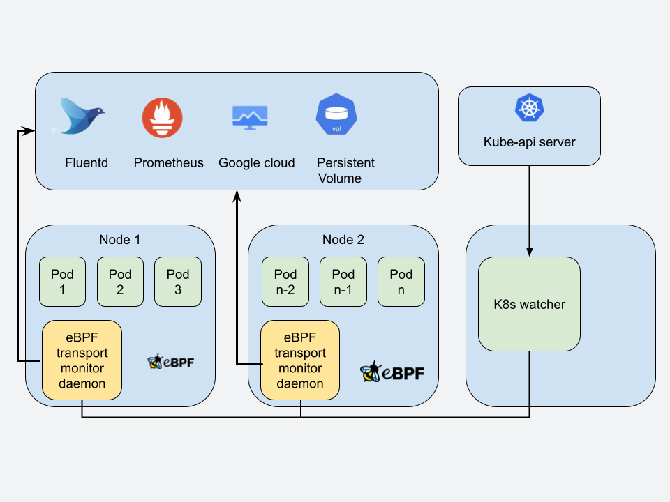

## eBPF Transport Monitoring

eBPF transport monitoring offers an innovative approach to observing the performance of TCP and HTTP/2 connections. It is fast, has low intrusiveness, is sandboxed, unified, and programmable.
Please refer [ebpf-transport-monitoring](https://github.com/google/ebpf-transport-monitoring).

## Kubernetes Deployment

The Kubernetes deployment works as shown in the architecture diagram.



A kubernetes cluster has a number of nodes. To observe events on nodes we will deploy daemons on each node which can monitor the tcp and application stack on the node. Additionally a watcher pod is also deployed. This pod takes a look at all pod additions, deletions and updates from the kube-api-server and communicates with lightfoot daemons what pods it needs to monitor on the node where the daemon is deployed. Lightfoot then starts monitoring processes in the selected pods. Logs and metrics are sent to multiple options including stackdriver, prometheus, fluent-d.

## Deploying Demo Application

The demo application has 3 grpc clients written in golang, c++ and node-js talking to a golang server. The communication between them using tls hence we generate secrets for them. Then ebpf-transport-monitoring(lightfoot) is built. Deploy the whole setup. This demonstration using docker-registry at localhost:50051. 

```
# Build applications
bash build.sh

# Create ssl certs and deploy them on kubernetes
bash create_secrets.sh

# Build lightfoot and the watcher application
bash build_lightfoot.sh 

# Deploy application
kubectl apply -f Deployments/application.yaml

# Make pods are deployed
kubectl get pods 

# Deploy lightfoot
helm install lightfoot
```

To enable lightfoot to track applications in a pod label `lightfoot:enable` is added to the pod.
```
apiVersion: v1
kind: Pod
metadata:
  name: go-client-pod
  labels:
    app: client
    lightfoot: enable
spec:
...
```

## Supports

* Golang 1.17 and above
* grpc-go
* Statically linked OpenSSL or BoringSSL
* Node js
* Crio runtime
* Kernel version 5.3 and above


## Roadmap

* Java h2 monitoring
* Monitoring plugin api definition
